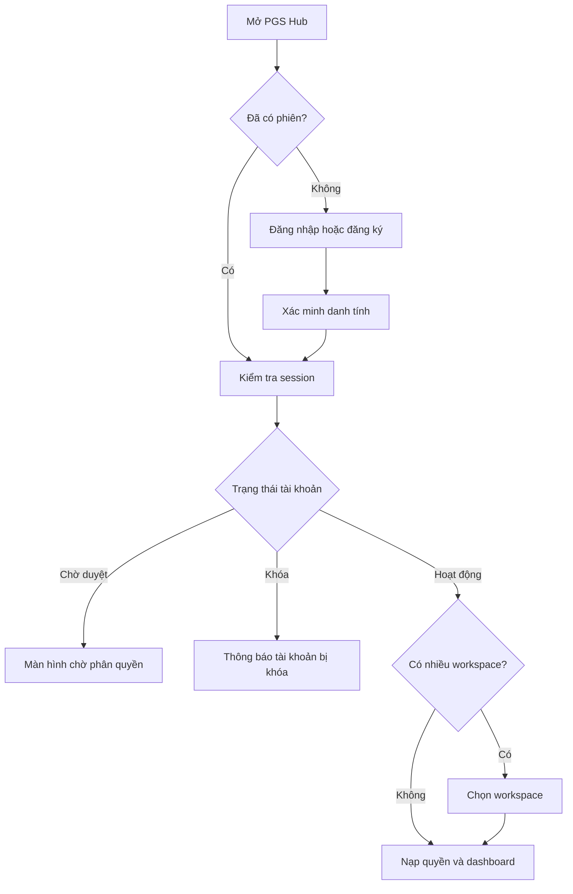
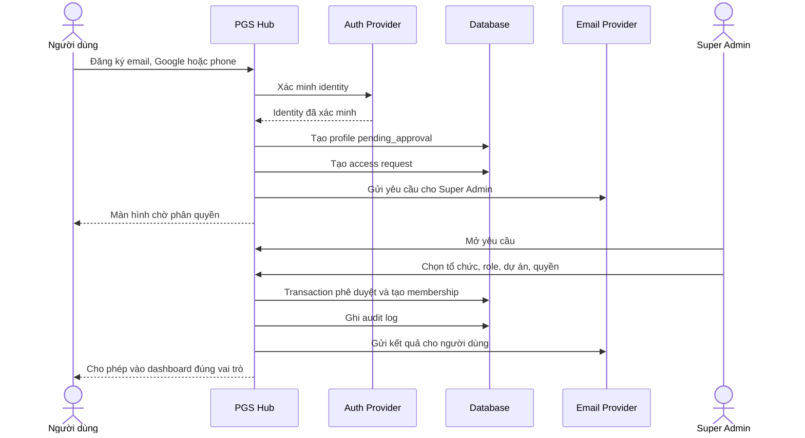
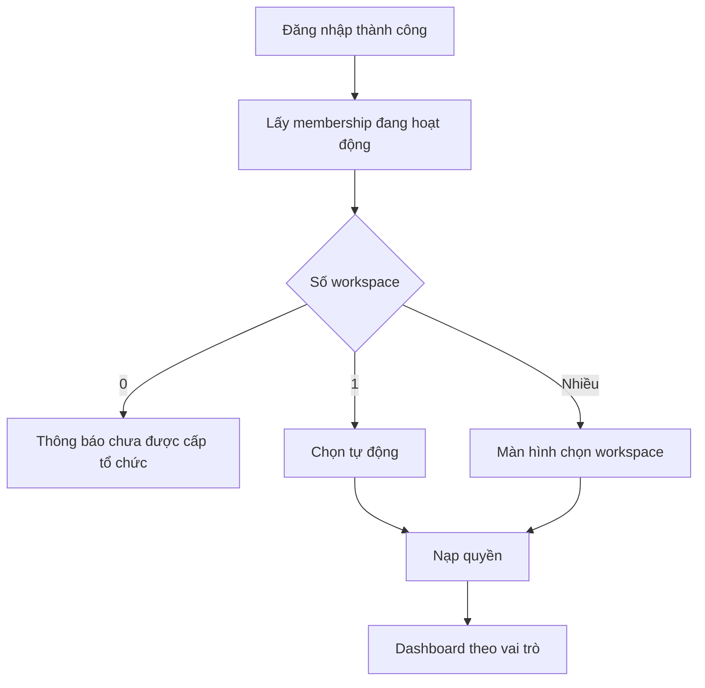
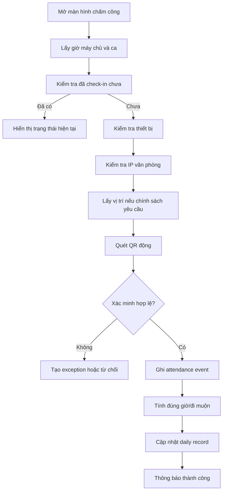
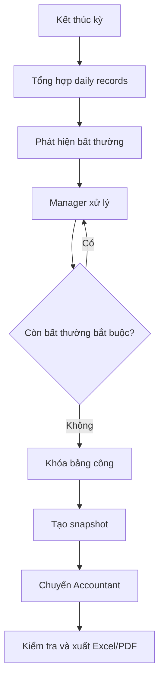
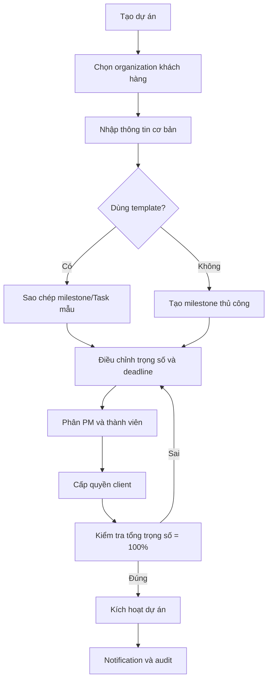
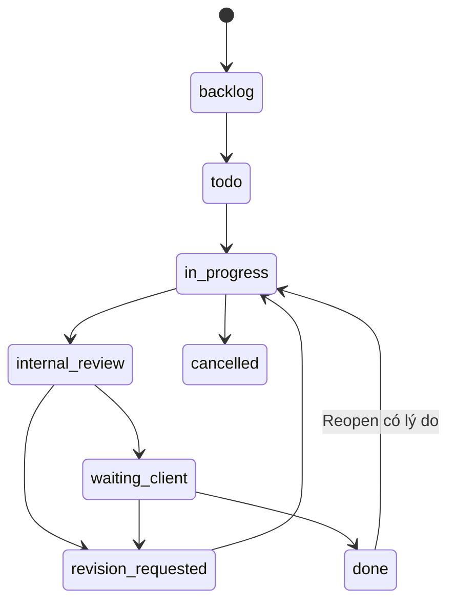
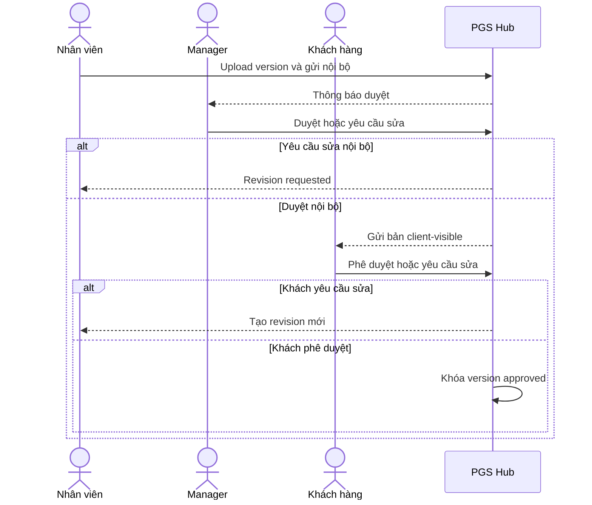
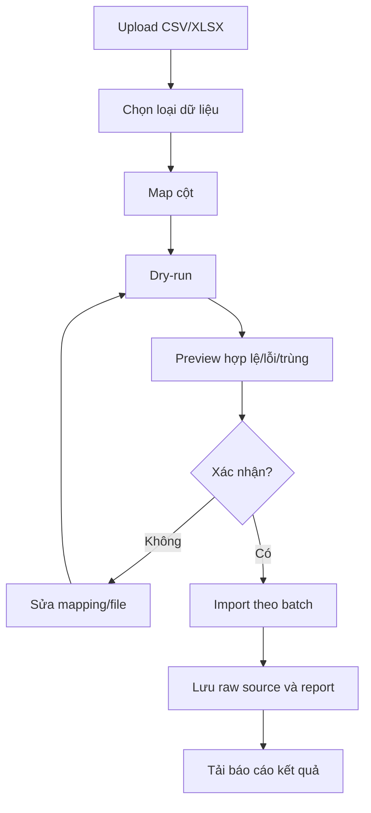

# 03 — Tài liệu luồng ứng dụng PGS Hub

## 1. Nguyên tắc luồng

- Mỗi người dùng bắt đầu từ xác thực, sau đó mới xác định trạng thái tài khoản, workspace và quyền.
- Server quyết định dữ liệu được trả về.
- Tài khoản pending không đi vào dashboard nghiệp vụ.
- Mọi hành động quan trọng tạo audit event.
- Mỗi thông báo phải dẫn đến đúng đối tượng cần xử lý.
- Luồng lỗi, hết phiên, thiếu quyền và mất mạng phải được thiết kế cùng luồng thành công.

## 2. Luồng tổng thể



## 3. Luồng đăng ký và phân quyền



### Trường hợp từ chối

- Admin phải nhập lý do nội bộ.
- Người dùng nhận thông báo chung, không lộ thông tin nhạy cảm.
- Profile chuyển `rejected` hoặc `suspended` theo nghiệp vụ.
- Ghi audit.

### Trường hợp trùng tài khoản

- Nếu Google/email/phone trùng identity đã xác minh, đề xuất liên kết.
- Nếu dữ liệu mâu thuẫn, tạo yêu cầu Admin xử lý.
- Không tự tạo profile thứ hai.

## 4. Luồng đăng nhập

### Email/password

```text
/login
→ nhập email/password
→ validate client
→ Auth Provider xác thực
→ kiểm tra account status
→ kiểm tra workspace
→ tạo session/ghi login
→ dashboard
```

### Google

```text
Chọn Tiếp tục bằng Google
→ OAuth consent
→ callback PKCE/state
→ lấy identity đã xác minh
→ link/tạo pending profile
→ kiểm tra account status
→ dashboard hoặc pending approval
```

### Phone OTP

```text
Nhập số điện thoại
→ chuẩn hóa E.164
→ rate limit
→ gửi OTP
→ nhập mã
→ verify TTL/attempt
→ link/tạo profile
→ dashboard hoặc pending approval
```

### Quên mật khẩu

```text
Nhập email
→ luôn trả thông báo trung tính
→ nếu tồn tại, gửi link có thời hạn
→ mở reset page
→ nhập mật khẩu mới
→ validate
→ cập nhật và thu hồi session cũ theo chính sách
→ ghi audit
→ đăng nhập lại
```

## 5. Luồng chọn workspace



Workspace hiện tại phải được kiểm tra lại phía server trên từng request; không chỉ lưu `organization_id` do client tự gửi.

## 6. Luồng Super Admin xử lý yêu cầu tài khoản

```text
Thông báo/email mới
→ /admin/access-requests
→ xem identity, thời gian, thông tin người dùng
→ kiểm tra trùng
→ chọn organization hoặc tạo mới
→ chọn base role
→ thêm custom role/quyền
→ chọn project membership nếu có
→ xác nhận
→ transaction cập nhật
→ audit
→ email người dùng
```

Nếu Super Admin rời màn hình giữa chừng, request vẫn ở trạng thái pending.

## 7. Luồng presence và session

```text
App foreground
→ heartbeat mỗi 60 giây
→ server cập nhật last_seen_at
→ online nếu trong 2 phút
→ khi logout ghi auth.logout
→ khi tab đóng không cần ghi audit liên tục
→ trạng thái tự về offline khi hết ngưỡng
```

Super Admin:

```text
Mở user detail
→ xem session/device
→ chọn thu hồi session
→ xác nhận hành động
→ server revoke
→ user bị yêu cầu đăng nhập lại
→ audit
```

## 8. Luồng chấm công vào



### Kết quả thành công

```text
Chấm công vào thành công lúc HH:mm
Trạng thái: Đúng giờ hoặc Đi muộn X phút
Địa điểm/hình thức: Văn phòng, remote, công tác...
```

### Lỗi có thể xảy ra

- Chưa cấp vị trí.
- Ngoài geofence.
- IP không hợp lệ.
- QR hết hạn.
- QR đã sử dụng.
- Thiết bị bị thu hồi.
- Đã check-in.
- Network/server lỗi.

Không hiển thị một lỗi chung cho mọi trường hợp.

## 9. Luồng thiết bị tin cậy

```text
Mỗi event hợp lệ trên cùng device ID
→ tăng verified_event_count
→ đủ 5 event
→ tạo trusted_device_candidate
→ thông báo Super Admin
→ Admin xem lịch sử/IP/user agent
→ duyệt hoặc từ chối
→ trusted/rejected
→ audit
```

Thiết bị trusted không bỏ qua toàn bộ IP/vị trí/QR; mức xác minh phụ thuộc policy.

## 10. Luồng chấm công ra

```text
Mở màn hình
→ xác định event check-in đang mở
→ xác minh theo policy
→ ghi check-out bằng giờ server
→ tính thời lượng, về sớm, thiếu giờ
→ cập nhật daily record
→ thông báo kết quả
→ audit
```

Nếu không có check-in, tạo yêu cầu bổ sung công hoặc exception, không tự bịa giờ vào.

## 11. Luồng nghỉ phép/bổ sung công

```text
Nhân viên tạo đơn
→ chọn loại/ngày/lý do/tệp nếu cần
→ validate số ngày/phép
→ gửi Manager
→ Manager duyệt/từ chối/yêu cầu bổ sung
→ cập nhật leave balance hoặc attendance adjustment
→ notification
→ audit
```

Đơn ảnh hưởng kỳ đã khóa phải qua quy trình mở lại/adjustment riêng.

## 12. Luồng khóa bảng công tháng



## 13. Luồng tạo dự án



Draft được lưu ở từng bước. Không tạo client membership vượt tổ chức.

## 14. Luồng dashboard dự án

```text
Vào /app/projects
→ xác định quyền và workspace
→ query KPI được phép xem
→ query danh sách phân trang
→ filter/sort
→ chọn một dự án
→ kiểm tra project membership
→ mở project overview
```

Không tải dữ liệu của dự án ngoài quyền rồi chỉ ẩn ở frontend.

## 15. Luồng milestone và tiến độ

```text
Manager cập nhật milestone completion
→ validate 0–100
→ kiểm tra quyền
→ lưu history
→ tính lại weighted project progress
→ đánh giá health/risk
→ cập nhật UI
→ audit
```

Nếu thay đổi weight:

- Chỉ người có quyền.
- Tổng weight vẫn bằng 100 trước khi lưu cấu hình active.
- Ghi before/after và lý do nếu dự án đã chạy.

## 16. Luồng Task chuẩn



### Điều kiện

- `internal_review`: có reviewer.
- `waiting_client`: có deliverable/file và internal approval.
- `revision_requested`: có comment yêu cầu sửa.
- `done`: lưu completed_by/completed_at.
- `reopen`: có reason và audit.

## 17. Luồng tạo Task

```text
Chọn Tạo Task
→ chọn project/milestone
→ nhập tiêu đề/mô tả
→ assignee/reviewer
→ priority/date/estimate
→ checklist/dependency/file
→ visibility
→ validate quyền và project membership
→ tạo Task
→ notification assignee
→ audit
```

## 18. Luồng Kanban kéo thả

```text
User kéo card
→ UI hiển thị optimistic state
→ gửi transition request
→ server kiểm tra permission + state machine + điều kiện
→ thành công: lưu history/audit/notification
→ thất bại: rollback card và hiển thị lý do
```

Không cho drag vượt qua bước duyệt chỉ bằng frontend.

## 19. Luồng duyệt deliverable



## 20. Luồng file và bình luận

### Upload

```text
Chọn file
→ validate phía client
→ request signed upload
→ server kiểm tra quyền/scope
→ upload private storage
→ finalize metadata
→ audit/notification
```

### Download

```text
Chọn download
→ server kiểm tra quyền và visibility
→ tạo signed URL ngắn hạn
→ ghi download audit nếu chính sách yêu cầu
→ tải file
```

### Comment

```text
Nhập comment
→ chọn/áp visibility mặc định
→ server kiểm tra permission
→ lưu comment
→ mention/notification
→ client chỉ nhận client_visible/project_members phù hợp
```

## 21. Luồng nhập dữ liệu cũ



## 22. Route map

### Public/Auth

```text
/login
/register
/login/phone
/auth/callback
/verify-email
/forgot-password
/reset-password
/pending-approval
/select-workspace
```

### Portal

```text
/app
/app/action-center
/app/projects
/app/projects/[projectId]/overview
/app/projects/[projectId]/timeline
/app/projects/[projectId]/tasks
/app/projects/[projectId]/approvals
/app/projects/[projectId]/conversations
/app/projects/[projectId]/files
/app/projects/[projectId]/activity
/app/tasks
/app/tasks/my-tasks
/app/tasks/[taskId]
/app/attendance
/app/attendance/history
/app/requests
/app/notifications
/app/profile
```

### Admin

```text
/admin
/admin/access-requests
/admin/organizations
/admin/clients
/admin/users
/admin/users/[userId]
/admin/roles
/admin/projects
/admin/hr/attendance
/admin/hr/policies
/admin/hr/payroll
/admin/devices
/admin/imports
/admin/audit-logs
/admin/settings
```

## 23. Luồng hết phiên và thiếu quyền

### Session expired

- Giữ đường dẫn hiện tại an toàn.
- Hiển thị thông báo phiên hết hạn.
- Chuyển login.
- Sau login quay lại nếu người dùng vẫn có quyền.

### 403

- Không để màn hình trắng.
- Hiển thị “Bạn không có quyền truy cập nội dung này”.
- Có nút quay lại dashboard.
- Không tiết lộ entity có tồn tại hay không nếu nhạy cảm.

### 404

- Entity không tồn tại hoặc không được phép thấy có thể trả 404 theo policy.

## 24. Luồng mất mạng

- Mutation đang gửi có disabled/loading.
- Nếu timeout, không tự khẳng định thành công.
- Cho phép retry an toàn.
- Idempotency tránh tạo trùng.
- Kanban rollback khi không xác nhận được server.
- Draft form được giữ cục bộ nếu không chứa dữ liệu nhạy cảm và chính sách cho phép.

