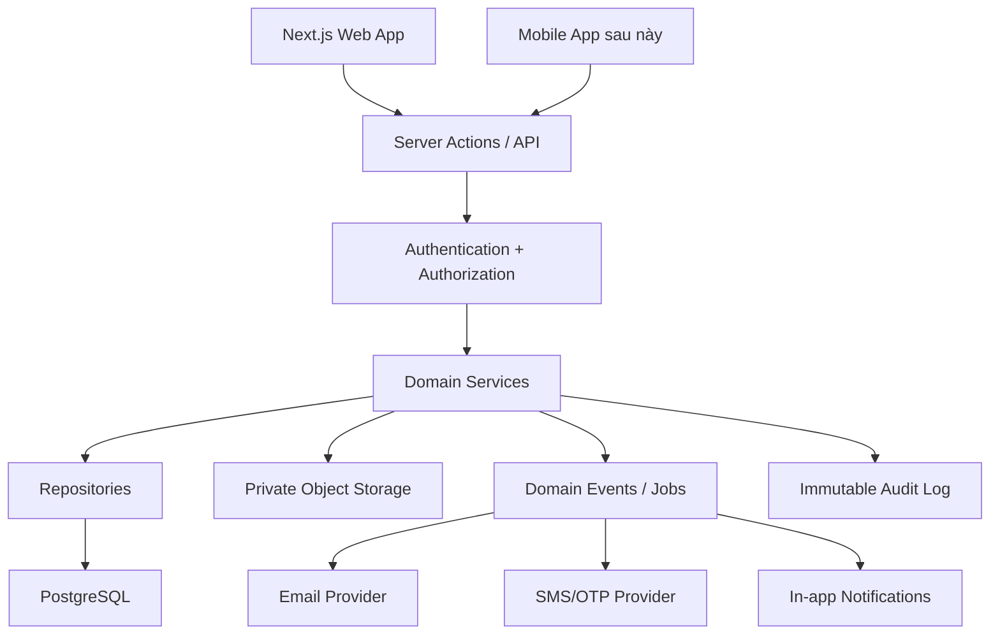

# 05 — Tài liệu cấu trúc backend PGS Hub

## 1. Mục tiêu kiến trúc

Backend là nguồn sự thật cho:

- Danh tính và phiên.
- Trạng thái tài khoản.
- Organization/workspace.
- Role và permission.
- Project membership.
- Attendance.
- Project/milestone/progress.
- Task workflow.
- File visibility.
- Approval/version.
- Notification.
- Audit.

Frontend không tự quyết định quyền hoặc trạng thái nghiệp vụ.

## 2. Sơ đồ kiến trúc



## 3. Modules

```text
AuthModule
IdentityModule
AccessRequestModule
OrganizationModule
PermissionModule
PresenceModule
DeviceModule
AttendanceModule
LeaveModule
TimesheetModule
ProjectModule
MilestoneModule
TaskModule
DeliverableModule
ApprovalModule
CommentModule
FileModule
NotificationModule
AuditModule
ImportModule
SettingsModule
```

Mỗi module có:

- Schema/types.
- Validator.
- Authorization policy.
- Use cases/services.
- Repository.
- API/server actions.
- Tests.

## 4. Auth và profile

### `profiles`

```text
id uuid PK, liên kết auth user
full_name
email_normalized nullable
phone_e164 nullable
avatar_url nullable
employee_code nullable unique
account_status enum
preferred_locale default vi
timezone default Asia/Bangkok
created_at
updated_at
last_login_at nullable
```

`account_status`:

```text
pending_verification
pending_approval
active
rejected
suspended
disabled
```

### `user_identities`

```text
id
user_id
provider enum: password/google/phone
provider_subject
email_or_phone_normalized
verified_at
created_at
last_used_at
UNIQUE(provider, provider_subject)
```

Không lưu password, OTP hoặc provider access token không cần thiết.

### `access_requests`

```text
id
user_id
requested_organization_name nullable
requested_role_note nullable
status pending/approved/rejected/cancelled
reviewed_by nullable
reviewed_at nullable
internal_reason nullable
created_at
```

## 5. Một Super Admin duy nhất

Không chỉ lưu role string trong profile. Dùng membership/role assignment nhưng tạo constraint bảo đảm chỉ một assignment `super_admin` active toàn hệ thống.

Phương án PostgreSQL đề xuất:

- Bảng `system_admin_assignment` chỉ cho phép một row với fixed primary key.
- Hoặc partial unique index trên một biểu thức/khóa singleton.
- Mọi thay đổi dùng stored procedure/transaction có lock.

Yêu cầu:

- Không public insert/update trực tiếp.
- Service role/server-only function.
- Re-authentication.
- Audit before/after.
- Thu hồi session Admin cũ nếu chuyển giao.

## 6. Organization và membership

### `organizations`

```text
id
legal_name
brand_name
organization_type
custom_type_label nullable
tax_code nullable
address nullable
representative_name nullable
email nullable
phone nullable
logo_file_id nullable
status active/inactive/archived
internal_notes nullable
created_by
created_at
updated_at
deleted_at nullable
```

### `organization_memberships`

```text
id
organization_id
user_id
base_role
status invited/active/suspended/removed
department_id nullable
joined_at nullable
created_by
created_at
UNIQUE(organization_id, user_id) cho membership active phù hợp
```

## 7. Role và permission

### `role_definitions`

```text
id
organization_id nullable cho system role
code
display_name
is_system
is_assignable
created_by
created_at
```

### `permissions`

```text
id
key unique
group_name
description
```

### `role_permissions`

```text
role_id
permission_id
effect allow/deny
```

### `user_permission_overrides`

```text
id
user_id
organization_id nullable
project_id nullable
permission_id
effect allow/deny
reason
expires_at nullable
created_by
created_at
```

Permission resolver:

```text
deny vì account status
→ kiểm tra Super Admin
→ base role
→ custom roles
→ project membership
→ explicit override
→ deny thắng allow ở cùng mức hoặc theo policy đã định nghĩa
```

Cache permission ngắn hạn nếu cần, phải invalidate khi role/membership đổi.

## 8. Session, presence và device

### `user_sessions`

```text
id
user_id
provider_session_id/hash
ip
user_agent
device_id nullable
created_at
last_seen_at
revoked_at nullable
revoked_by nullable
revoke_reason nullable
```

Không lưu raw refresh token nếu auth provider đã quản lý.

### `user_presence`

```text
user_id PK
session_id
last_seen_at
current_workspace_id nullable
current_route_category nullable
```

Không lưu URL nhạy cảm đầy đủ nếu không cần.

### `trusted_devices`

```text
id
user_id
device_public_id
friendly_name
user_agent_summary
status candidate/trusted/rejected/revoked
verified_event_count
first_seen_at
last_seen_at
approved_by nullable
approved_at nullable
revoked_by nullable
revoked_at nullable
```

## 9. Audit log

### `audit_logs`

```text
id bigserial/uuid
actor_user_id nullable cho system
action
entity_type
entity_id nullable
organization_id nullable
project_id nullable
request_id
ip nullable
user_agent nullable
metadata jsonb đã lọc secret
created_at server time
```

Yêu cầu:

- Append-only ở application role.
- Không expose delete endpoint.
- Không cascade delete khi user/project bị xóa mềm.
- Index actor/action/entity/time/org/project.
- Retention policy riêng nhưng không cho xóa tùy ý từ UI.

## 10. Cấu trúc chấm công

### `office_locations`

```text
id
organization_id
name
address
latitude
longitude
geofence_radius_meters
timezone
status
```

### `office_networks`

```text
id
office_location_id
cidr_or_public_ip
label
active
```

### `work_shifts`

```text
id
organization_id
name
start_local_time
end_local_time
break_minutes
grace_minutes
crosses_midnight
active
```

### `work_schedules`

```text
id
organization_id
user_id nullable
department_id nullable
shift_id
day_of_week
effective_from
effective_to nullable
```

### `holidays`

```text
id
organization_id
date
name
is_paid
is_working_override
```

### `attendance_policies`

```text
id
organization_id
name
requires_office_ip
requires_geofence
requires_qr
requires_trusted_device
trusted_candidate_event_count default 5
late_rules jsonb hoặc bảng riêng
effective_from
effective_to nullable
```

### `attendance_events`

Raw, append-only:

```text
id
organization_id
user_id
event_type check_in/check_out
occurred_at server UTC
work_mode office/remote/business_trip/client_visit
office_location_id nullable
public_ip nullable
latitude nullable
longitude nullable
geo_accuracy_meters nullable
device_id nullable
qr_nonce_hash nullable
verification_status
verification_factors jsonb
source web/mobile/import/adjustment
import_batch_id nullable
created_at
```

### `attendance_daily_records`

Derived record:

```text
id
organization_id
user_id
work_date local date
shift_id
first_check_in_at nullable
last_check_out_at nullable
worked_minutes
late_minutes
early_leave_minutes
overtime_minutes
day_status
exception_count
calculation_version
locked_at nullable
UNIQUE(user_id, work_date, shift_id)
```

### `attendance_exceptions`

```text
id
daily_record_id/event_id
type
severity
status open/pending_review/approved/rejected/resolved
message
resolution_note nullable
reviewed_by nullable
reviewed_at nullable
```

### `attendance_adjustments`

Không sửa raw event. Adjustment tham chiếu record/event, lưu before/after, reason, requester, approver và audit.

### `leave_balances`, `leave_requests`, `overtime_requests`

Tách balance transaction nếu cần để không mất lịch sử. Approval workflow nhất quán.

### `monthly_timesheets`

```text
id
organization_id
year
month
status draft/manager_review/locked/accountant_review/exported/reopened
standard_workdays
calculation_version
locked_by nullable
locked_at nullable
snapshot_hash nullable
```

`monthly_timesheet_lines` lưu snapshot từng người.

## 11. Cấu trúc project

### `projects`

```text
id
organization_id khách hàng
project_code unique
name
service_type
parent_project_id nullable
manager_user_id
account_user_id nullable
planned_start_date
planned_end_date
actual_start_date nullable
actual_end_date nullable
priority
status
health
progress_percent
description
scope
risks nullable
internal_notes nullable
created_by
created_at
updated_at
deleted_at nullable
```

### `project_memberships`

```text
id
project_id
user_id
member_type internal/client
project_role
visibility_scope
permissions_override nullable
status
added_by
added_at
UNIQUE(project_id, user_id) cho active membership
```

### `project_status_history`

```text
id
project_id
from_status
to_status
reason nullable
changed_by
changed_at
```

### `project_health_history`

Lưu system suggestion, manual override, signals và lý do.

## 12. Template và milestone

### `project_templates`

```text
id
name
service_type
version
status
created_by
```

Milestone/task template được copy sang project khi tạo. Không để dự án cũ phụ thuộc template mutable.

### `milestones`

```text
id
project_id
name
description nullable
weight_percent decimal
completion_percent decimal
planned_start_date
deadline
owner_user_id nullable
status
position
created_at
updated_at
```

Constraint/business validation:

- Weight 0–100.
- Completion 0–100.
- Tổng weight bằng 100 trước project activation.
- Position unique trong project nếu cần.

Progress service tính lại trong transaction hoặc job tin cậy sau milestone mutation.

## 13. Cấu trúc Task

### `tasks`

```text
id
project_id
milestone_id nullable
task_code
title
description nullable
task_type nullable
priority
status
visibility
start_date nullable
deadline nullable
estimate_minutes nullable
actual_minutes nullable
reviewer_user_id nullable
created_by
completed_by nullable
completed_at nullable
cancelled_at nullable
reopen_reason nullable
version integer cho optimistic concurrency
created_at
updated_at
deleted_at nullable
UNIQUE(project_id, task_code)
```

### `task_assignees`

Hỗ trợ một hoặc nhiều assignee nếu sản phẩm cần. MVP có thể giới hạn primary assignee nhưng schema không nên khóa đường mở rộng.

### `task_watchers`

User nhận notification nhưng không nhất thiết có quyền mutation.

### `task_checklist_items`

```text
id
task_id
content
is_completed
position
completed_by nullable
completed_at nullable
```

### `task_dependencies`

```text
task_id
depends_on_task_id
dependency_type blocks/relates_to
```

Chặn vòng lặp dependency.

### `task_status_history`

Lưu from/to, actor, reason, timestamp và source drag/drop/form/API.

## 14. Comment và visibility

### `task_comments`

```text
id
task_id
author_user_id
body_rich_text/body_plain
visibility internal/project_members/client_visible/private
parent_comment_id nullable
created_at
updated_at
deleted_at nullable
```

RLS/server serialization phải loại comment internal khỏi client response. Không query tất cả rồi filter ở browser.

## 15. Deliverable và approval

### `deliverables`

```text
id
task_id
project_id
title
type
status
current_version_id nullable
client_visible
created_by
created_at
```

### `deliverable_versions`

```text
id
deliverable_id
version_number
file_id/content_snapshot
change_note nullable
created_by
created_at
locked_at nullable
checksum nullable
UNIQUE(deliverable_id, version_number)
```

### `approvals`

```text
id
deliverable_version_id
stage internal/client
reviewer_user_id nullable
status pending/approved/revision_requested/cancelled
comment nullable
decided_by nullable
decided_at nullable
deadline nullable
```

Bản approved/locked không update nội dung. Revision tạo version mới.

## 16. File

### `files`

```text
id
organization_id
project_id nullable
task_id nullable
scope
original_name
mime_type
size_bytes
storage_key
current_version
uploaded_by
scan_status
created_at
deleted_at nullable
```

### `file_versions`

Lưu storage key, checksum, version, uploader và created time.

## 17. Notification và outbox

### `notifications`

```text
id
recipient_user_id
type
title
body
entity_type
entity_id
deep_link
read_at nullable
event_id unique/idempotency
created_at
```

### `email_outbox`

```text
id
recipient
template_key
payload jsonb
status pending/sending/sent/failed
attempt_count
next_attempt_at
provider_message_id nullable
event_id unique
last_error_safe nullable
created_at
sent_at nullable
```

Domain event ví dụ:

```text
UserRegistered
AccessRequestApproved
TaskAssigned
TaskOverdue
TaskSentForInternalReview
DeliverableSentToClient
DeliverableApproved
AttendanceExceptionCreated
TrustedDeviceCandidateCreated
TimesheetLocked
```

## 18. Import

### `import_batches`

```text
id
type
source_file_id
status uploaded/mapped/validated/importing/completed/failed/rolled_back
mapping jsonb
total_rows
valid_rows
invalid_rows
duplicate_rows
created_by
created_at
completed_at nullable
```

### `import_rows`

```text
id
batch_id
row_number
raw_payload jsonb
normalized_payload jsonb nullable
status valid/invalid/duplicate/imported/skipped
error_codes jsonb nullable
target_entity_id nullable
```

## 19. RLS/authorization matrix tóm tắt

| Entity | Super Admin | Manager | Employee | Accountant | Client | Viewer |
|---|---|---|---|---|---|---|
| Organization | Tất cả | Được giao | Membership | Được cấp | Chính mình | Được cấp |
| User | Tất cả | Nhóm/dự án | Chính mình | Phạm vi HR | Thành viên client được phép | Được cấp |
| Project | Tất cả | Được giao | Membership/Task | Được cấp | Organization + membership | Được cấp |
| Task | Tất cả | Project scope | Assigned/member | Được cấp | Client-visible | View only |
| Internal comment | Tất cả | Project scope | Project scope | Nếu được cấp | Không | Theo quyền, mặc định không |
| Attendance | Tất cả | Nhóm | Chính mình | Được cấp | Không | Không |
| Audit | Tất cả | Theo permission hạn chế | Không | Không mặc định | Không | Không |

Chi tiết phải được test, không chỉ dựa bảng tài liệu.

## 20. Service interfaces

```ts
interface AuthorizationService {
  can(userId: string, permission: string, scope: AuthorizationScope): Promise<boolean>;
  require(userId: string, permission: string, scope: AuthorizationScope): Promise<void>;
}

interface ProjectProgressService {
  recalculate(projectId: string): Promise<ProjectProgressResult>;
}

interface TaskWorkflowService {
  getAllowedTransitions(input: TaskTransitionContext): Promise<TaskStatus[]>;
  transition(input: TransitionTaskInput): Promise<Task>;
}

interface AttendanceVerificationService {
  verify(input: AttendanceVerificationInput): Promise<AttendanceVerificationResult>;
}

interface NotificationService {
  publish(event: DomainEvent): Promise<void>;
}
```

## 21. Endpoint/use case đề xuất

Không bắt buộc REST nếu dùng Server Actions, nhưng cần các use case tương đương:

### Auth/Admin

```text
createAccessRequest
approveAccessRequest
rejectAccessRequest
assignRole
updatePermissions
revokeSession
approveTrustedDevice
```

### Attendance

```text
getAttendanceContext
checkIn
checkOut
createLeaveRequest
createAttendanceAdjustmentRequest
reviewAttendanceException
lockMonthlyTimesheet
exportMonthlyTimesheet
```

### Project

```text
listProjects
getProject
createProject
updateProject
activateProject
updateProjectMembers
createMilestone
updateMilestone
recalculateProjectProgress
```

### Task

```text
listTasks
createTask
updateTask
transitionTask
reopenTask
addChecklistItem
addComment
uploadTaskFile
submitInternalReview
sendToClient
approveDeliverable
requestRevision
```

## 22. Transaction boundaries

Dùng transaction cho:

- Approve account + membership + role + audit/outbox.
- Transfer Super Admin.
- Create project from template.
- Activate project validation.
- Task transition + status history + audit/outbox.
- Approval + deliverable lock + Task transition.
- Lock timesheet + snapshot.
- Import batch commit theo chunk.

Nếu notification/email gửi ngoài transaction, ghi outbox trong transaction rồi worker gửi sau.

## 23. Concurrency

- Project/milestone/task có version hoặc updated_at compare.
- Task Kanban conflict trả mã lỗi rõ.
- Approval dùng unique pending stage/version.
- Check-in dùng unique/locking để tránh chấm trùng.
- Import có idempotency key/batch state.
- Timesheet lock có row lock.

## 24. Backup và data safety

- Backup DB trước migration lớn.
- Storage private và versioning/backup.
- Không cascade xóa audit, attendance raw, approval evidence.
- Production destructive operation cần confirm và audit.
- Soft delete cho project/task/file phù hợp.
- Restore drill định kỳ.

## 25. Backend acceptance criteria

- Chỉ một Super Admin active được bảo đảm ở database.
- Pending user bị chặn ở database/API.
- Cross-org/project access test pass.
- Attendance dùng server time và lưu verification factors.
- Project progress tính đúng trọng số.
- Task transition không thể bypass qua API.
- Internal comment/file không trả về client.
- Approved version không ghi đè.
- Audit append-only từ application.
- Import có dry-run và không ghi đè âm thầm.
- Migration và production build pass.

