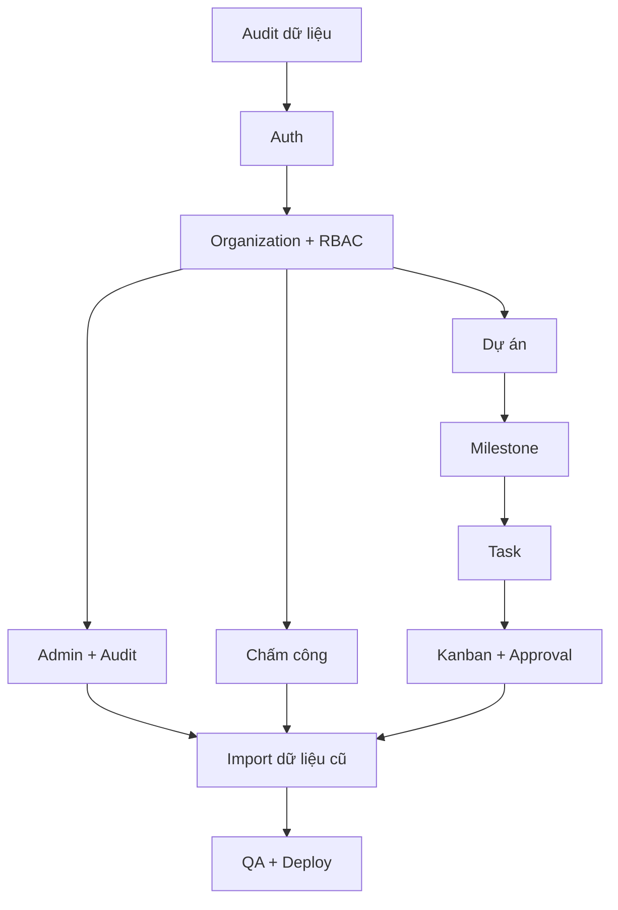

# 06 — Kế hoạch thực hiện PGS Hub

## 1. Nguyên tắc triển khai

- Hoàn thiện web app trước, mobile app sau.
- Không bắt đầu bằng giao diện dashboard khi auth/RLS chưa có nền tảng.
- Không xóa module cũ đang hoạt động.
- Không làm migration phá dữ liệu.
- Mỗi phase phải build/test pass trước phase tiếp theo.
- Mỗi chức năng phải có UI, server logic, authorization, audit và test tương ứng.
- Provider thiếu credentials không được fake success.

## 2. Kết quả đầu ra

```text
Source code hoàn chỉnh
Database migrations
RLS/authorization policies
Development seed
Test suite
.env.example
README
Provider setup guides
Import templates
Deployment guide
Rollback guide
```

## 3. Phase 0 — Audit repository và bảo vệ dữ liệu

### Mục tiêu

Hiểu chính xác hiện trạng trước khi code.

### Công việc

1. Kiểm tra framework, package manager và phiên bản Node.
2. Kiểm tra cấu trúc route/component/module.
3. Kiểm tra auth hiện có.
4. Kiểm tra database schema/migration/RLS.
5. Kiểm tra storage.
6. Kiểm tra module chấm công, project, Task cũ.
7. Kiểm tra dữ liệu demo và production path.
8. Kiểm tra `.env` usage nhưng không in secret.
9. Chạy lint/typecheck/test/build hiện trạng.
10. Lập danh sách phần giữ, phần sửa, phần tạo mới.
11. Tạo backup/dump hoặc xác nhận cơ chế backup trước migration.

### Đầu ra

- Báo cáo audit ngắn.
- Sơ đồ kiến trúc hiện tại.
- Migration plan.
- Risk register.
- Baseline build/test result.

### Gate

Không qua Phase 1 nếu chưa biết database production và chưa có phương án giữ dữ liệu cũ.

## 4. Phase 1 — Nền tảng thiết kế và project structure

### Công việc

- Cấu hình design tokens vàng–trắng.
- Space Grotesk.
- App shell desktop/tablet/mobile.
- Shared form/table/dialog/toast/status components.
- Error boundary, 403, 404, session expired.
- Server/client module boundary.
- Validation/error convention.
- Request ID và structured logs nền tảng.

### Gate

- Responsive shell hoạt động.
- Không tự đổi màu/font/radius.
- Lint/typecheck/build pass.

## 5. Phase 2 — Auth và onboarding

### Công việc

1. Email/password.
2. Email verification.
3. Google OAuth.
4. Phone OTP.
5. Forgot/reset password.
6. Profile và identities.
7. Account status.
8. Pending approval page.
9. Access request.
10. Email Super Admin.
11. Session management.
12. Login/logout audit.
13. Rate limit.
14. Một Super Admin constraint.

### Test bắt buộc

- Register → pending.
- Pending không đọc dữ liệu.
- Approve → active.
- Duplicate identity.
- Forgot/reset.
- Rate limit OTP/login.
- Chỉ một Super Admin.

### Gate

- Auth thật hoạt động hoặc provider adapter báo chưa cấu hình rõ.
- Không có mock auth trong production.
- Cross-route guard pass.
- Build pass.

## 6. Phase 3 — Organization, role và permission

### Công việc

- Organizations CRUD.
- Membership.
- Workspace selector.
- Base roles.
- Custom role UI.
- Permission matrix.
- User permission override.
- Project membership foundation.
- RLS/authorization service.
- Account approval wizard.

### Test

- Client A không thấy B.
- Employee không thấy org khác.
- Viewer không mutation.
- Permission override.
- Role change invalidates cache/session context.

### Gate

Không triển khai nghiệp vụ tiếp theo nếu authorization test chưa pass.

## 7. Phase 4 — Admin, presence và audit

### Công việc

- Admin dashboard.
- Access request queue.
- User list/detail.
- Organization/client list.
- Online presence.
- Session list/revoke.
- Trusted device list nền tảng.
- Audit log list/filter/detail.
- Action Center nền tảng.

### Test

- Online threshold.
- Revoke session.
- Permission change audit.
- Audit không delete từ UI/API application.
- Admin-only routes.

## 8. Phase 5 — Chấm công foundation

### Công việc

- Office locations.
- Office IP/CIDR.
- Geofence settings.
- Work shifts/schedules.
- Holiday/working override.
- Attendance policies.
- Dynamic QR generator/verifier.
- Device ID.
- Check-in/check-out.
- Daily record calculation.
- Success/error UI.
- Audit.

### Test

- Server time.
- Check-in duplicate.
- Invalid/expired/replayed QR.
- IP/geofence combinations.
- Missing location permission.
- Check-out without check-in.
- Cross-midnight structure.

### Gate

- Không dùng client time.
- Không nhận diện người chỉ bằng IP.
- Raw event append-only.

## 9. Phase 6 — Chấm công nâng cao và kế toán

### Công việc

- 5 verified events → device candidate.
- Admin approve/revoke trusted device.
- Late policy tiers.
- Early leave/missing checkout.
- Attendance exceptions.
- Leave balances.
- Leave/remote/business trip/overtime requests.
- Attendance adjustment.
- Monthly timesheet.
- Manager review.
- Lock/snapshot.
- Accountant review.
- Excel/PDF export.

### Test

- Tháng 28/29/30/31 ngày.
- Weekend/holiday/work override.
- Late tiers.
- Locked period immutable.
- Adjustment after lock.
- Employee only sees own timesheet.

## 10. Phase 7 — Project overview và CRUD

### Công việc

- Project schema/migration.
- Project permissions.
- Project overview KPI.
- Filter/sort/pagination.
- List và mobile cards.
- Create/edit project wizard.
- Project status/history.
- Project health/history.
- Members management.
- Project templates foundation.

### Test

- Scope theo role.
- Client project isolation.
- Create draft.
- Activate validation.
- Status history.
- Mobile layout.

## 11. Phase 8 — Milestone và project detail

### Công việc

- Milestone CRUD.
- Validate weight.
- Weighted progress service.
- Project detail header.
- Overview/timeline tabs.
- Health signals.
- Activity feed.
- Team/next deadline/task summary placeholders dùng dữ liệu thật.

### Test

- Total weight 100.
- Weighted formula.
- Decimal rounding.
- Milestone history.
- Health system suggestion/manual override.
- Không dùng Task count làm progress mặc định.

## 12. Phase 9 — Task core

### Công việc

- Task schema/migration.
- Task CRUD.
- My Tasks.
- Project Task list.
- Assignee/reviewer/watchers.
- Checklist/subtasks.
- Dependencies và cycle prevention.
- Priority/deadline/estimate.
- Status history.
- Notification Task assigned/overdue.

### Test

- Permission create/update.
- Assigned scope.
- Dependency cycle.
- Overdue calculation.
- Done/reopen metadata.

## 13. Phase 10 — Kanban và workflow

### Công việc

- Server state machine.
- Allowed transition service.
- Kanban UI.
- Drag/drop optimistic + rollback.
- Filter project/assignee/priority.
- Mobile state tabs.
- Keyboard alternative.

### Test

- Bypass transition API bị chặn.
- Drag unauthorized rollback.
- Internal review requires reviewer.
- Waiting client requires deliverable.
- Revision requires comment.
- Reopen requires reason.

## 14. Phase 11 — File, comment, deliverable và approval

### Công việc

- Private storage.
- Signed upload/download.
- File versioning.
- Comment visibility.
- Mention.
- Deliverable/version.
- Internal review.
- Client review.
- Approve/revision.
- Lock approved version.
- Notification/deep link.

### Test

- Client không lấy internal file/comment qua API.
- MIME/size validation.
- Signed URL permission.
- Approved version immutable.
- New revision creates version.
- Approval audit.

## 15. Phase 12 — Notification và Action Center hoàn thiện

### Công việc

- In-app notification.
- Email outbox/retry.
- Deep link.
- Read/unread.
- Idempotency.
- Role-specific Action Center.
- Provider missing configuration state.

### Test

- Retry không gửi lặp.
- Deep link đúng quyền.
- User không nhận notification entity ngoài quyền.

## 16. Phase 13 — Nhập dữ liệu cũ

### Công việc

- CSV/XLSX parser.
- Import type selector.
- Column mapping.
- Dry-run.
- Row validation.
- Duplicate detection.
- Batch commit.
- Raw source/report.
- Error export.
- Rollback khi an toàn.

### Template

- Organizations.
- Users/employees.
- Projects.
- Milestones.
- Tasks.
- Attendance.
- Leave.
- Monthly timesheet.

### Test

- Re-import same batch.
- Duplicate employee/email/phone.
- Duplicate project code.
- Duplicate attendance event.
- Partial invalid rows.
- Large batch within limit.

## 17. Phase 14 — QA, bảo mật và tối ưu

### Functional QA

- Toàn bộ acceptance criteria sản phẩm.
- Tất cả role.
- Desktop/tablet/mobile.
- Empty/loading/error/session states.

### Security QA

- IDOR.
- Cross-org/project.
- RLS.
- Upload.
- Rate limit.
- Secret exposure.
- XSS/rich text.
- Session revoke.

### Performance QA

- N+1.
- Pagination.
- Index.
- Bundle.
- Kanban load.
- Dashboard queries.

### Accessibility QA

- Keyboard.
- Focus.
- Labels.
- Contrast.
- Screen reader basics.
- Reduced motion.

## 18. Phase 15 — Deploy và bàn giao

### Staging

- Env config.
- Migration dry-run.
- Seed development only.
- Smoke test.
- User acceptance test.

### Production

- Backup.
- Migration.
- Deploy.
- Smoke test.
- Monitor error/log/job.
- Rollback plan sẵn sàng.

### Bàn giao

- README.
- `.env.example`.
- Provider guides.
- Backup/restore.
- Import templates.
- Test commands.
- Deploy/rollback.
- Known limitations.
- Phase mobile app proposal.

## 19. Thứ tự phụ thuộc



## 20. Ưu tiên nếu cần ra MVP sớm

P0:

- Auth và pending approval.
- Một Super Admin.
- Organization/RBAC/RLS.
- Admin user management/audit.
- Check-in/out cơ bản.
- Project overview/CRUD/milestone.
- Task list/Kanban/workflow.

P1:

- Trusted device/QR/geofence nâng cao.
- Leave/timesheet/export.
- Deliverable approval/versioning.
- Import data cũ.

P2:

- Calendar/timeline/workload nâng cao.
- Mobile push.
- Desktop attendance agent.
- Ads/contracts/payments mở rộng.

Không bỏ bảo mật/RLS khỏi P0.

## 21. Definition of Done cho mỗi ticket

- Requirement và acceptance rõ.
- Code đúng module.
- Migration nếu cần.
- Authorization server-side.
- Validation.
- Loading/success/error/empty.
- Audit/notification nếu yêu cầu.
- Unit/integration test.
- Responsive.
- Accessibility cơ bản.
- Lint/typecheck/build pass.
- Documentation cập nhật.

## 22. Báo cáo tiến độ Antigravity phải cung cấp

Sau mỗi phase:

1. File đã tạo/sửa.
2. Migration đã tạo.
3. Chức năng đã hoạt động.
4. Test/build đã chạy và kết quả.
5. Credentials/config còn thiếu.
6. Rủi ro hoặc giới hạn.
7. Bước tiếp theo.

Không chỉ nói “đã hoàn thành” mà không có bằng chứng build/test.

## 23. Tiêu chí dừng

Antigravity chỉ dừng khi:

- Phase được yêu cầu đã code xong.
- Test liên quan pass.
- Production build pass.
- Không còn lỗi TypeScript/lint.
- Có hướng dẫn cấu hình cho phần cần credentials.
- Có tóm tắt thay đổi và bước tiếp theo.

Nếu bị chặn bởi provider credential, hoàn thiện adapter/UI/database/test bằng mock chỉ trong development, không fake success production, và tiếp tục phần không bị chặn.

